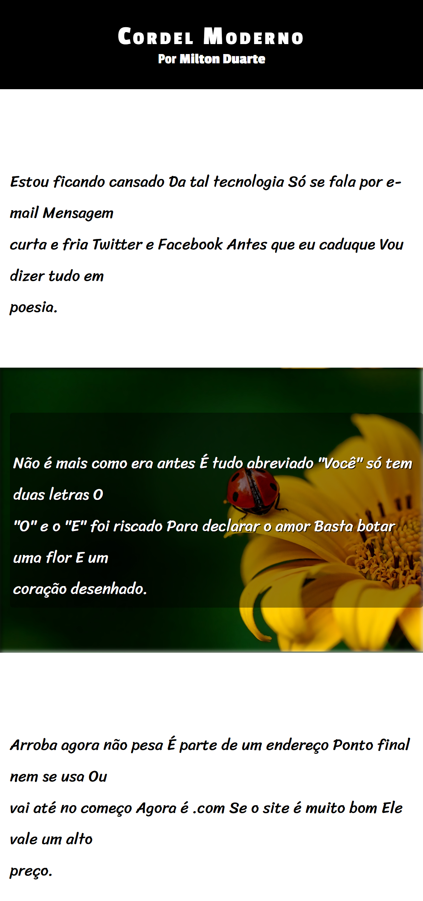

# 📜 Projeto Cordel Moderno

---

Projeto desenvolvido durante os estudos de HTML5 e CSS3 no curso do CursoemVídeo, com o objetivo de criar uma página web inspirada na literatura de cordel, unindo elementos da cultura nordestina com técnicas modernas de desenvolvimento front-end.

O projeto explora fortemente tipografia, efeito parallax, cores, layout responsivo e boas práticas de estruturação semântica, resultando em uma página visualmente marcante e bem organizada.

## 👀 Preview do Projeto

- **💻 Desktop**
  

- **📽️ Preview Gif**
  

## 🌐 Acesse o Projeto

👉 [Clique aqui para acessar o site](https://devsandrobatista.github.io/projeto-cordel/)

## 🎯 Objetivo do Projeto

- Este projeto foi desenvolvido com o objetivo de:
- Praticar HTML5 semântico
- Trabalhar com CSS3 moderno
- Explorar tipografia personalizada
- Aplicar o efeito parallax com background-attachment: fixed
- Criar uma página visualmente agradável e responsiva
- Unir conteúdo cultural com técnicas modernas de front-end

⚠️ **Observação:** este projeto não possui interatividade com JavaScript.
O foco é layout, estilização e apresentação de conteúdo.

## 🛠️ Tecnologias Utilizadas

- HTML5
- CSS3
- Efeito Parallax
- Layout Responsivo
- Google Fonts
- Estrutura semântica

## 📂 Estrutura do Projeto

projeto-cordel/ 
├── 📂 assets/ 
│ ├── 📂 css/ 
│ │ ├── reset.css 
│ │ └── style.css 
│ ├── 📂 images/ 
│ │ ├── background1.jpg 
│ │ ├── background2.jpg 
│ │ └── preview-desktop.png 
│ └── 📂 videos/ 
├── .gitattributes 
├── index.html 
├── LICENSE 
└── README.md

## 🚀 Como Executar o Projeto

Não é necessário instalar nenhuma dependência.

**Passos:**

1.  Clone o repositório:

        git clone https://github.com/devsandrobatista/projeto-cordel.git

2.  Acesse a pasta do projeto:

        cd projeto-cordel

3.  Abra o arquivo index.html diretamente no navegador
    ou utilize a extensão Live Server no VS Code para uma melhor experiência.

## 🖥️ Uso / Funcionalidades

- Leitura fluida do conteúdo em formato de cordel
- Efeito parallax durante a rolagem da página
- Tipografia personalizada para reforçar a identidade visual
- Layout adaptável para diferentes tamanhos de tela

**Indicado para:**

- Estudos de HTML e CSS
- Aprendizado de efeito parallax
- Projetos de portfólio front-end
- Referência de estrutura e estilização de páginas estáticas

## 📚 Créditos

Projeto desenvolvido com base no conteúdo educacional do [CursoemVídeo](https://www.youtube.com/@cursoemvideo)

**Professor:** [Gustavo Guanabara](https://github.com/gustavoguanabara)

**Curso:** [HTML5 e CSS3: modulo 4 de 5](https://www.cursoemvideo.com/curso/curso-html5-e-css3-modulo-4-de-5-40-horas/)

## 📄 Licença

Este projeto está sob a licença MIT.

Sinta-se livre para estudar, modificar e reutilizar.
